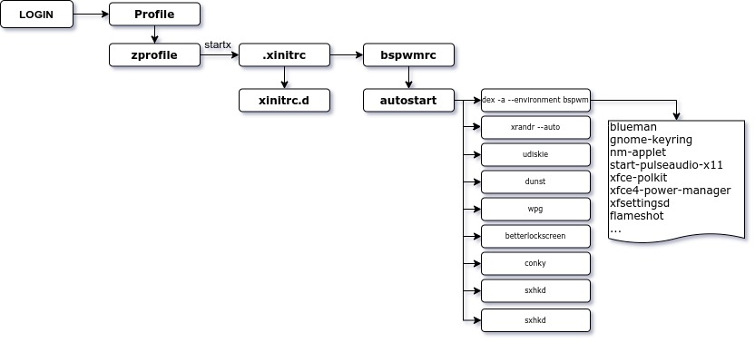

# My Linux [dotfiles](https://en.wikipedia.org/wiki/Hidden_file_and_hidden_directory)

This is the main dotfile I use with my Gnome Desktop Environment. 

 

    

# TL;DR
 The summary of what I am using is given below.

- autostart desktop files
- conky` config files
- neofetch
- nvim (with [vim-plug](https://github.com/junegunn/vim-plug))
- rofi
- zsh

 

- some custom scripts in `~/.local/share/bin`

The overall flow of how you login and how all the scripts are ran is shown in the below picture.

# Installation
I have followed the git bare method to manage my dotfiles explained in [this page](https://harfangk.github.io/2016/09/18/manage-dotfiles-with-a-git-bare-repository.html).
