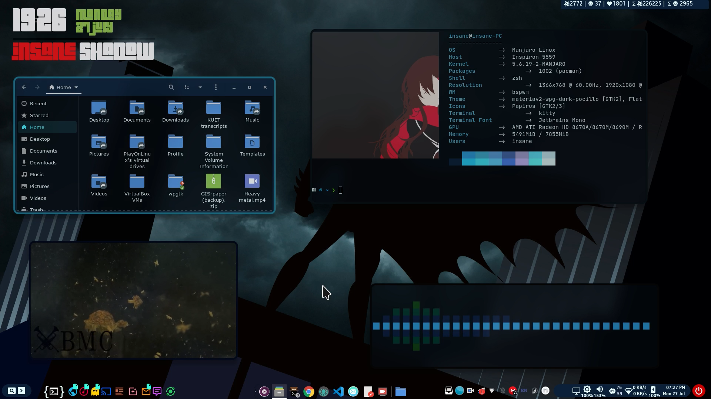

# My Linux [dotfiles](https://en.wikipedia.org/wiki/Hidden_file_and_hidden_directory)

This is the main dotfile I use with my [BSWM](https://github.com/baskerville/bspwm). **[See live demo here](https://youtu.be/ymmVCshHyGE)**

 

    

 

# TL;DR
 The summary of what I am using is given below.

- autostart desktop files
- betterlockscreen
- bspwmrc (and its relevant files)
- conky` config files
- dunst
- kitty
- neofetch
- nvim (with [vim-plug](https://github.com/junegunn/vim-plug))
- picom ([ibhagwan fork](https://github.com/ibhagwan/picom))
- polybar
- rofi
- sxhkd
- wpgtk
- zsh

 

- some custom scripts in `~/.local/share/bin`
- Customized version of [Materia-v2 GTK theme](https://gitlab.com/codic12/materiav2)

The overall flow of how you login and how all the scripts are ran is shown in the below picture.

# Installation
I have followed the git bare method to manage my dotfiles explained in [this page](https://harfangk.github.io/2016/09/18/manage-dotfiles-with-a-git-bare-repository.html).

For convinience, I already created necessary scripts for this. After installation of any Arch-based distro, just the scripts in `~/.dots-git/scripts` sequentially (or follow the [post](https://harfangk.github.io/2016/09/18/manage-dotfiles-with-a-git-bare-repository.html) to understand what you should do).

# About the theme
Basically, I use [wpgtk](https://github.com/deviantfero/wpgtk) to manage my colors and keep them synced with the wallpaper. For this, I have changed some files of materiav2 theme mentioned above, and made theme templates for wpgtk (just changed the colors to wpgtk color templates).
